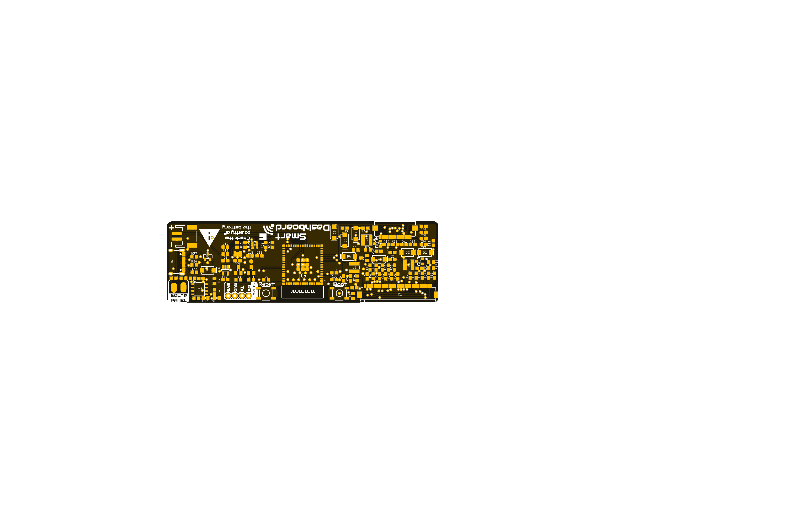
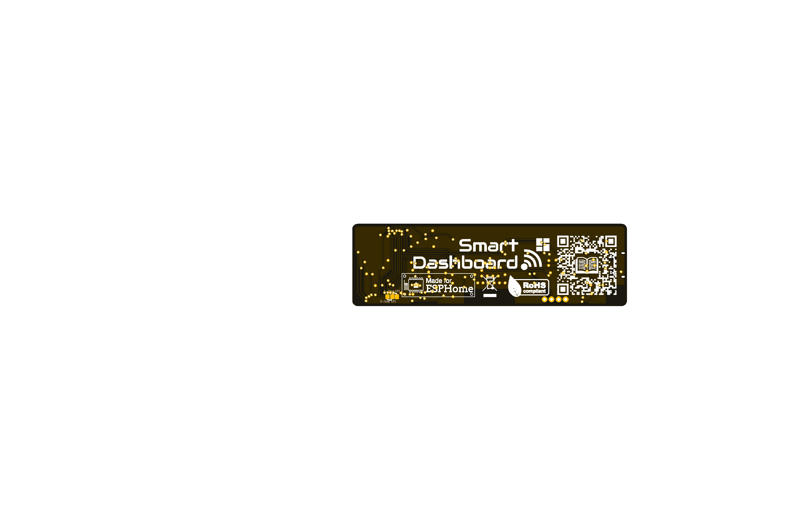

[![Documentation Status][documentation-shield]][documentation]
[![GitHub Release][releases-shield]][releases]
[![License][license-shield]](LICENSE)

[![Project Maintenance][maintenance-shield]][maintenance]
[![BuyMeCoffee][buymecoffee-shield]][buymecoffee]

# Smart Dashboard
The Smart Dashboard is a platform to help display any kind of information on two kinds of ePaper display: the 7.5" black & white display and the 7.3" 7-colors display, both from Waveshare. It includes a BMP280 sensor for air temperature and pressure as well as all the electronics to work with the minimum power consumption, supporting solar charging.

   
      

## Project tree

<li><a href="./Design/">Design</a></li>
<li><a href="./Documentation/">Documentation</a></li>

<li><a href="./README.md">README.md</a></li>

[documentation-shield]: https://readthedocs.org/projects/smart-dashboard/badge/?version=latest&style=for-the-badge
[documentation]: https://smart-dashboard.readthedocs.io

[releases-shield]: https://img.shields.io/github/release/JGAguado/Smart_Dashboard.svg?style=for-the-badge
[releases]: https://github.com/JGAguado/Smart_Dashboard/releases

[license-shield]: https://img.shields.io/badge/License-CC%20BY--NC--SA%204.0-lightgrey.svg?style=for-the-badge

[maintenance-shield]: https://img.shields.io/badge/maintainer-J.%20G.%20Aguado-blue.svg?style=for-the-badge
[maintenance]: https://github.com/JGAguado

[buymecoffee-shield]: https://img.shields.io/badge/buy%20me%20a%20coffee-support-yellow.svg?style=for-the-badge
[buymecoffee]: https://www.buymeacoffee.com/J.G.Aguado

