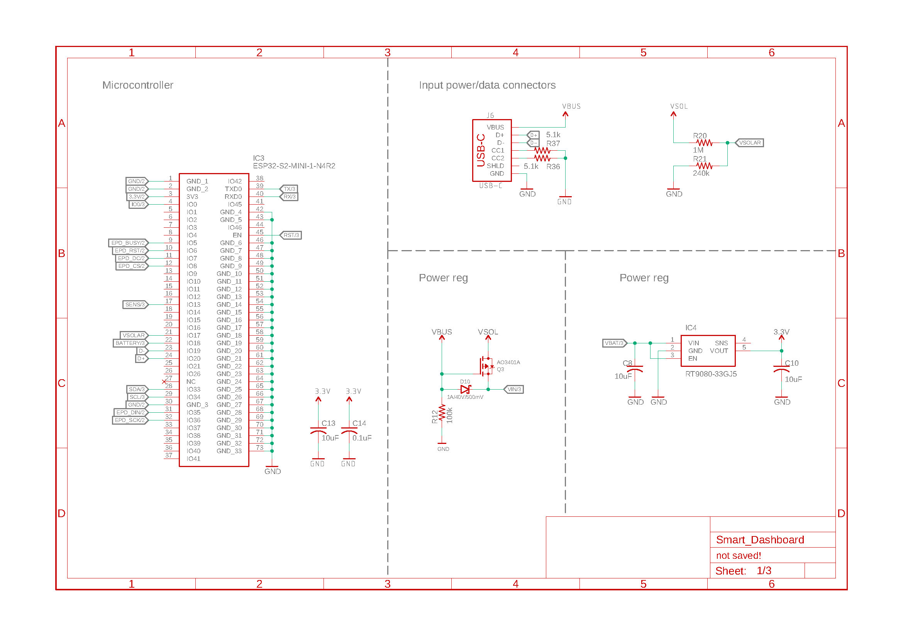
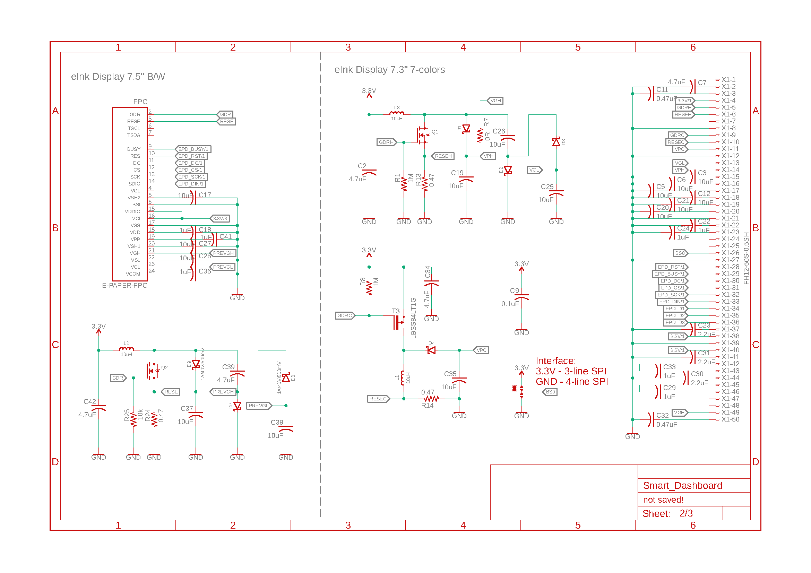
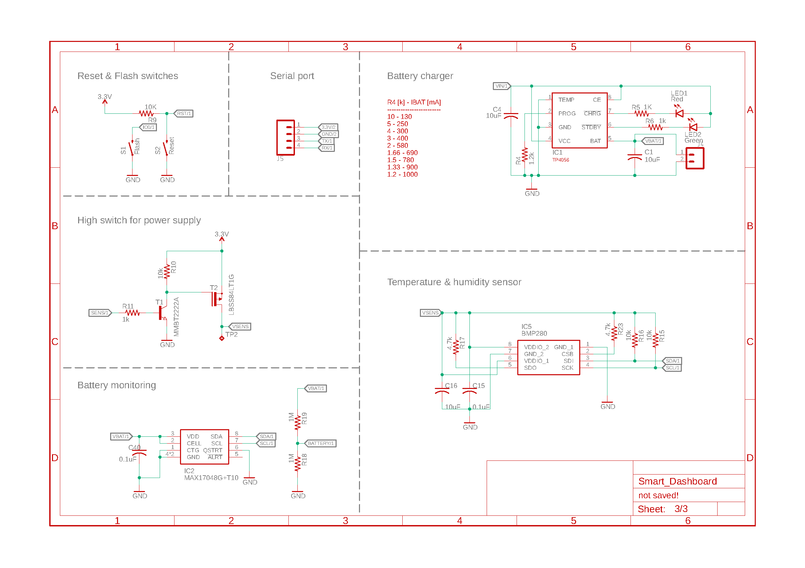
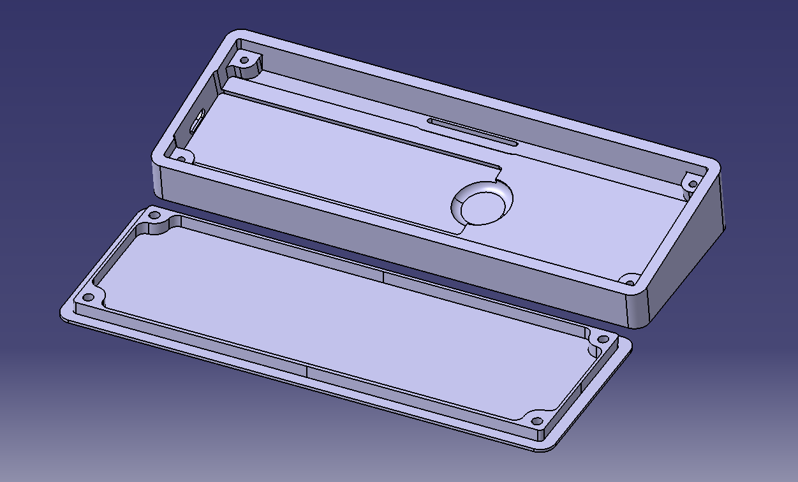

Schematics and drawings
=======================

Electronic schematics
---------------------

:download:`Download PDF <../../Documentation/Schematics/Schematic.pdf>`

.. _pcb:

:term:`PCB`
----------

.. raw:: html

    <iframe src="_static/ibom.html" height="800px" width="100%"></iframe>

.. _dock:

Dock stand
-----------------------

.. Caution::
    The following enclosure was designed for 5050100 (100x50x5mm) 4000mAh LiPo battery. The recommended battery wouldn't fit in this enclosure.

 - :download:`Bottom <../../Enclosure/Bottom.stl>`
 - :download:`Top <../../Enclosure/Top.stl>`
