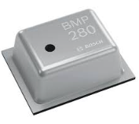

💡 Getting started
===============

Assembly 
----------
Due to the high amount of components integrated in such small PCB layout, most of them are too small to be soldered at home by you. Therefore, these boards come already 
with the components assembled. 

The |Product|, in addition to the PCB assembled board, consist on the following parts:

- An e-paper display. The recommended (and tested working) e-ink panels are the `800×480, 7.5" E-Ink display <https://www.waveshare.com/7.5inch-e-Paper.htm>`_ or the  
  `800×480, 7.3" ACeP 7-Color E-Ink Display <https://www.waveshare.com/7.3inch-e-Paper-F.htm>`_. Please note only one display can be connected at the same time and 
  that **other displays may not work at all**.
- A :term:`LiPo` battery, with a recommended 5000mAh capacity, for space and power. The 6060100 3.7V 5000mAh LiPo battery meets this criteria.
- An :ref:`dock` for allocating the electronics + battery + e-paper display. 
- Optionally, you can mount a solar panel that charges the battery under the right sunny conditions. The output voltage of the panel musn't excess the 6V.

Powering
--------
The |Product| is be powered through a :term:`LiPo` battery plugged into the white JST connector. The voltage of the battery is regulated to the working 3.3V through a low-consumption :term:`LDO`.

.. Caution::
    Connect the battery after clamping the e-paper connector and be careful when plugging it or removing it, since the connector can be hard to plug/unplug.

In order to charge the battery, there is a battery management IC that provides the right charging curve to the :term:`LiPo` battery and offers a visual indicator (red LED for charging, 
green LED for standby) while the battery is being charged. There are two ways of charging the |Product|: USB-C or solar panel.

Solar panel
^^^^^^^^^^^^^
.. figure:: images/getting_started/Solar_soldering.png
    :align: right
    :figwidth: 200px
    
In addition to the USB-C, and with the aim of extending the service time between (USB) charges of the battery, the |Product| can be configured to be powered from a solar panel. This feature 
would imply soldering the solar pannel to the board as indicated in the figure.

USB-C
^^^^^^^^^^^^^
The USB Type-C is a very extended port for portable electronics, and because of it's standarized 5V power supply is ideal for charging the |Product|.

Sensors
--------
    
As the |Product| is intended to work during long periods of time without having to be recharged, it is important to avoid undesired consumptions 
durint the deep-sleep periods. This implies that the sensors have to be powered **only** when they are needed. 

Therefore there is a high-switch circuit that enables/disables the powering of the *sensors power line* connected to the microcontroller's output **GPIO4**.

Regarding the embedded sensors they use the digital bus :term:`IIC` (:math:`I^2C`), which are physically defined with the following pinout:

:SDA: **GPIO33**
:SCL: **GPIO34**

Ambient temperature & pressure 
^^^^^^^^^^^^^^^^^^^^^^^^^^^^^^^

The |Product| embeds an BMP280 temperature and pressure sensor ready to deliver calibrated data through the :math:`I^2C` bus.

This sensor has an operational pressure range of 300 up to 1100 hPa ( with a ±1hPa typical accuracy), and a temperature range of -40 to 85 °C (±1 °C typical accuracy)

The :math:`I^2C` address is **0x77**.

Battery level
^^^^^^^^^^^^^^^^
For measuring the battery level, the |Product| integrates the MAX17048 :term:`IC`.

This sensor measures the voltage of the LiPo cell and does the math to get an estimative percentage of the battery level.

The :math:`I^2C` address is **0x36**.

E-paper
--------

The |Product| is capable of driving two different e-paper displays: 

- `800×480, 7.5" E-Ink display <https://www.waveshare.com/7.5inch-e-Paper.htm>`_.
- `800×480, 7.3" ACeP 7-Color E-Ink Display <https://www.waveshare.com/7.3inch-e-Paper-F.htm>`_.

However only one can be driven at the same time, since they share the SPI bus pins:

.. list-table:: Pinout table
    :widths: 10 10 
    :header-rows: 1

    * - ESP32
      - E-paper
    * - 5
      - BUSY
    * - 6
      - RST
    * - 7
      - DC/MISO
    * - 36
      - CLK
    * - 35
      - DIN/MOSI
    * - 8
      - CS

Dock stand
------------
The |Product| PCB can be mounted in a custom :ref:`dock` that you can print on your own 3D printer.